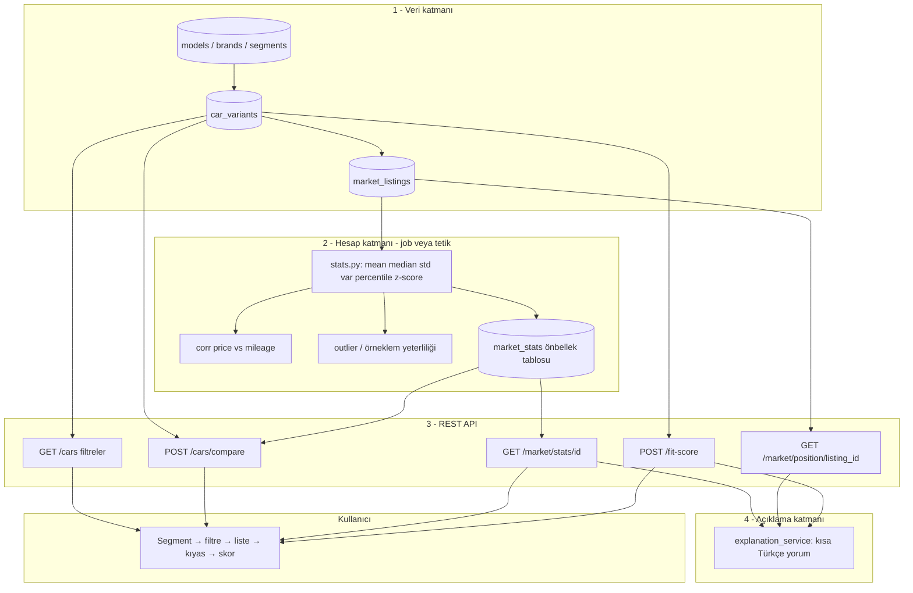
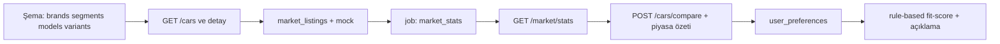
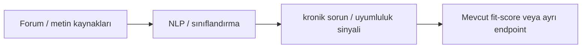

# Araç kıyaslama / piyasa özeti — pipeline ve MVP sırası

**Ürün adı: ArabaIQ.** Segment ve filtre motoru: **Segmento.** Uygulama kodu: [`araba-iq-api/`](../araba-iq-api/README.md).

> Not: E-ticaret tarafı **Django + DRF**; ArabaIQ API ayrı servis olarak **FastAPI + PostgreSQL** (`docker-compose`: `araba-iq-db`, port 5433).

## İsim önerisi (kısa)

| Aday        | Güçlü yön                          | Zayıf yön / dikkat        |
|------------|-------------------------------------|----------------------------|
| **ArabaIQ**| TR’de anında anlaşılır, “akıllı seçim” | Global marka biraz yerel   |
| **OtoSkor**| Skor + kıyas doğrudan                | Daha “araç” değil “skor” hissi |
| **Carlytics** | Veri / analitik, startup dili     | TR’de telaffuz / açıklama gerekebilir |

**Öneri:** Birincil marka **ArabaIQ**; uluslararası / ikinci marka veya alt ürün adı olarak **Carlytics**.

---

## 1) Uçtan uca veri ve ürün pipeline’ı (MVP)

Aşağıdaki akış “önce ne oturur, sonra ne beslenir” sırasını gösterir.

**Özet:** İlanlar `market_listings`’e girer → periyodik job `market_stats`’ı doldurur → API hem sayı hem `explanation_service` ile metin döner → kıyas ve fit-score bu tablolardan beslenir.

---

## 2) MVP geliştirme sırası (senin 7 günlük planın — tek şema)

---

## 3) Faz 3+ (şimdilik dışarıda — pipeline’a sonradan eklenir)

---

## 4) API yanıt ilkesi

Her istatistik cevabında: **ham metrik + `price_comment` (veya eşdeğeri)** birlikte; pozisyon için **z-score + ucuz/normal/pahalı + yüzde farkı**.

---

## 5) İlk yapılacaklar (bugün checklist)

1. Ürün adını kilitle (öneri: **ArabaIQ**).
2. Tablolar: `brands`, `segments`, `models`, `car_variants`, `market_listings` (+ isteğe bağlı `market_stats` ilk günden tasarla, doldurmayı 4. güne bırakabilirsin).
3. Endpointler: `GET /cars`, `GET /cars/{id}`, `POST /cars/compare`, `GET /market/stats/{car_variant_id}`.
4. 10–15 mock ilan; `stats` + kısa Türkçe yorum.
5. Sonra: tercihler + `POST /fit-score` + `POST /recommendations`.
